# 🎬 Restaurant Recommendations: Unlocking Insights for a Restaurant Business

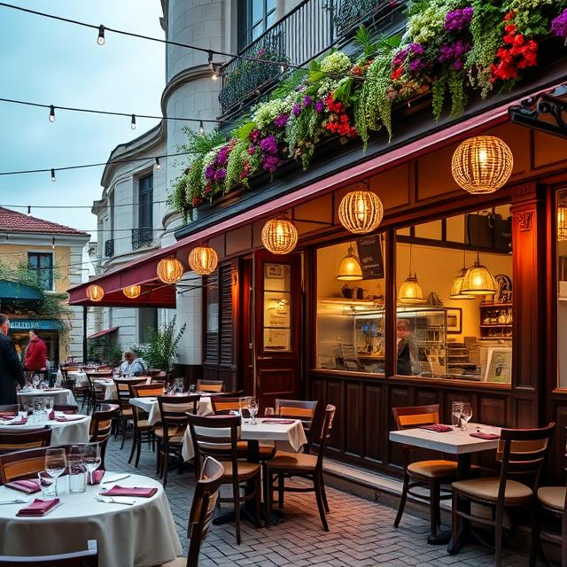&nbsp;

## 📌 Project Overview
This project focuses on analyzing the *RESTAURANTS AND USERS* database to extract valuable insights that can enhance business operations, marketing strategies, and inventory management. SQL is extensively used to perform exploratory data analysis (EDA), understand the database schema, and answer critical business queries.

---

## 🎯 Project Goals

### 🛒 Users Insights

- 📌 Identify user details (Most visited Restaurants, Location, Time of Day, Weather) to enhance targeted marketing campaigns.
- 📊 Analyze user behavior to improve restaurant management.

### 🎮 Restaurant Management

- 🛆 Evaluate most restaurant user and categorize on Cuisine, Location and Weather.
- 🔍 Suggest recommendations for expanding the restaurants based on popularity and no of users, location and price.

### 💰 Revenue Enhancement

- 📈 Examine restaurants pricing trends to identify profitable pricing strategies.
- 🎥 Determine the most no of users for restaurants on location, cuisine, gender and pricing.

### ⚙️ Operational Efficiency

- 📌 Track and manage restaurant location based on time of day and weather.
- 📉 Identify users according to location and time of day.

---

## 🛠️ Tools & Technologies Used
- *SQL* – Data extraction, transformation, and querying
- *RESTAURANT_RECOMMENDATIONS Database* – Source of restaurant recommendations data

---

## 📊 Insights & Expected Outcomes
- 📢 *Enhanced marketing strategies* based on user location and preferences.
- 🎬 *Optimized restaurant management* with improved suggestion for restaurant according to location and weather.
- 💵 *Increased revenue generation* through data-driven pricing and user preferences.
- 📌 *Operational efficiency* with a structured approach to restaurant location and cuisine.

---

# Restaurant Recommendations Data Queries

This repository contains SQL queries and corresponding visualizations for analyzing the Restaurant Recommendation dataset.

## Queries and Visualizations

### 1. Group all users according to Age Group and Count Age and Name Age Group as  
       18 - 28 Youth
       29 - 38 Young Adult
       39 - 48 Adult
       Other

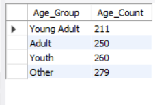

### 2. List 10 Users whose Preferred_cuisine as Indian
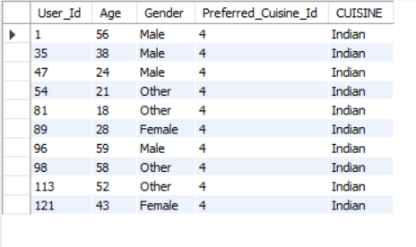

### 3. List Gender wise User count
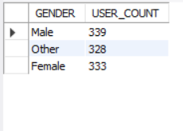

### 4. List all users who have Interaction_Type 'like'

### 5. List all users who visited Restaurant on 1-Jan-2024
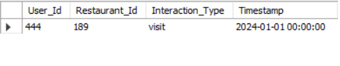

### 6. List all Restaurant whose name starts with 'B'
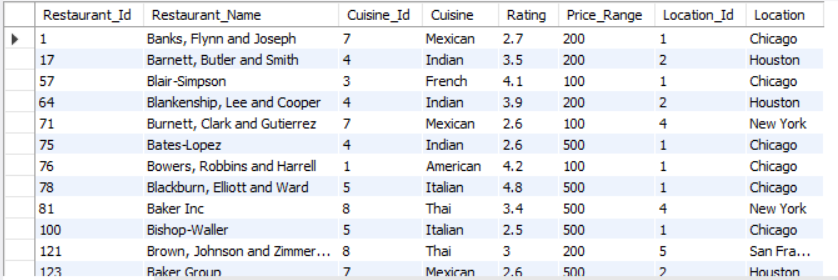

### 7. List cuisine wise restaurant count
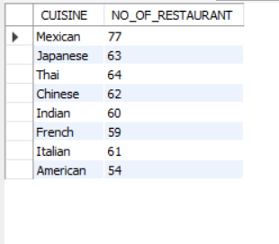

### 8. List all restaurant whose rating is greater than 4
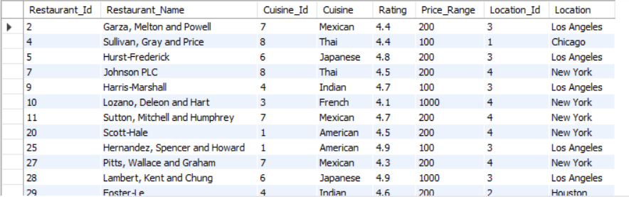

### 9. Count No of Restaurant based on Price_Rating
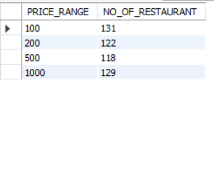

### 10. List Restaurant_Id, Restaurant_Name, Cuisine, Rating, Price_Range, Location where location is Los Angeles
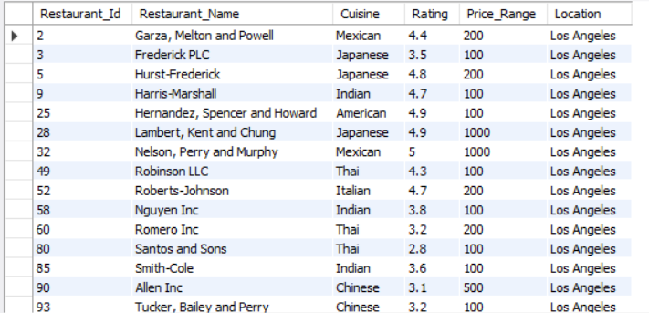

### 11. Count restaurant based on Location
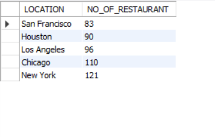

### 12. List all restaurant name where weather is Sunny and time of day is Night
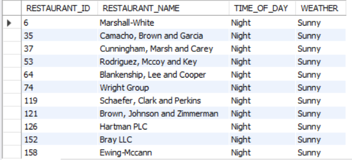

### 13. List User 314 User_Id, Age, Gender, Restaurant_Id, Interaction_Type, 
        Timestamp, Restaurant_Name, Cuisine, Rating, Price_Range, Location, Interaction_Id, Time of day, Weather
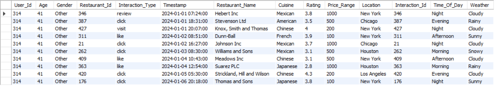

### 14. List User 551 date wise all restaurant details
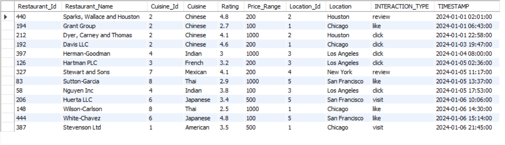

### 15. Which restaurant has most user
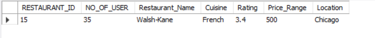

---
